# Shipwreck | Roblox Game
A year long game development project started 09/01/2017 which greatly increased my CS problem-solving skills.

Unfortunately, my inexperienced self was unable to futureproof the fact that `FilteringEnabled` (1) would be forcefully implemented onto every game, thus breaking it during development.

(1) Segregates client/server data to prevent unwanted client-sided changes from replicating to the server; remotes are used to ensure only developer-allowed changes would be made. As a result, this update reduces the ability for exploiters to alter the game environment for other players. 

This repository README.md is a collection of GIFs that show milestones and random things during my development. *Written with fanciness.*

# The Beginnings...
I had loaded up the file with no actual concepts in my mind. The only thought I had at the time was "I want to play a survival game."
I was aware of the limitations of both my computer and my skills as a developer. Although I had prior experience to programming, a fullscale game was something that exceeded my abilities. <a id="restriction1"><a/>Furthermore, my computer lacked the resources needed to make a graphically intensive game. However, that did not stop me from my path to developing a game I wanted to play.

I figured a low-poly base survival game was what I will make. So to start off, I began by making triangular hills which represented terrain. Then I created a house and a farm which I would later use to test farming mechanics.

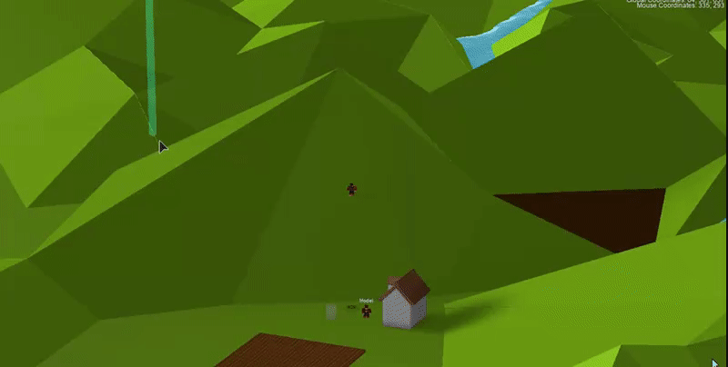

# To Bring Life...
At a young age I already understood the difference between a good game and a bad one. Gamers are lifeless entities in the physical world, this is an undeniable fact; those who object are merely in denial. We play video games in order to escape reality for even a moment of our life, outcast ourselves from society albeit yearn for some form of interaction with others. With this in mind, a wise developer would then choose to implement artificial beings, NPCs as they are commonly referred to as, in order to satiate even a pitiful fraction of the players emotional void. As such, two beings were introduced: Follower, a model of the player which, as the name suggests, follows you; Slime, a monster whose life was given by me with the intent of ending yours (however fails to do so.)

While I may have been only twelve at the time, I had already experienced the struggles of a parent. This slime that I had so painstakingly created turns out to be... ~~stupid~~ lacking any sign of intelligence?

# The Beginning of the Downfall
Reminiscing on this project made me realize it's own downfall. During these years, I had onced believe that I had limitless time— I was young, with unbounded freedom and shackles which restrain the adults are not yet mine to bear. The low-poly aesthetic was a suitable design choice, however, there arose a conflict between my inner selves. One wanted a minimalistic game, a low-poly to be specific, whereas the other desired for even a subtle touch of realism. My brain was struggling to decide between the two and thus devised a simple solution: the player can choose their experience. As such, I created a settings page.

Texturing the grass had arose another problem within my mind: If the creator grants the player the choice to alter their own experience, shouldn't they also be given the ability to change the ambience of it? As such, lighting styles were implemented.

One may think the following words could only be said by a childish person,
> Weapons. I like swords. I REALLY like swords. No survival game is good enough unless it had swords.

As a matter of fact, it was. An aspect of me that would also contribute to the games demise.

How could a game be considered a "survival" game if it lacks the ability to acquire resources. While earth takes several years to renew a single tree, my world instantaneously generates them. Additionally, while a child is born dependant on their parents, the player is spawned given a freaking sword to slay enemies and an axe to deforest Gaia's children.

Realism. What good is a world attempting to feel realistic when the character does not behave realistically. For example, the walking animation of the player looks— nevermind, let's not touch the player animation.

# Its a bird, its a goose, no its a dinosaur... what is it?
A dinosaur, an ostrich, or a goose? This is a question I had asked myself when I wanted to implement more life into my game. My answer to the question: all three, in one. 

I created the basic design of my creature, which I named 'Qerk' (derived by the sound it is supposed to make, imagine a goose on the spectrum.) I tried granting my creature some motor control but had failed to give it the ability to balance itself.

After some tweaking, the 'Qerk' gained the ability to remain upright. However, I began to dislike the name 'Qerk' and switched for a less creative name 'Gies'.

Caught on film is a wild Gies resting peacefully on the new terrain which I had created for my game. This is the last sighting of the Gies before the creator had decided to remodel them in blender.

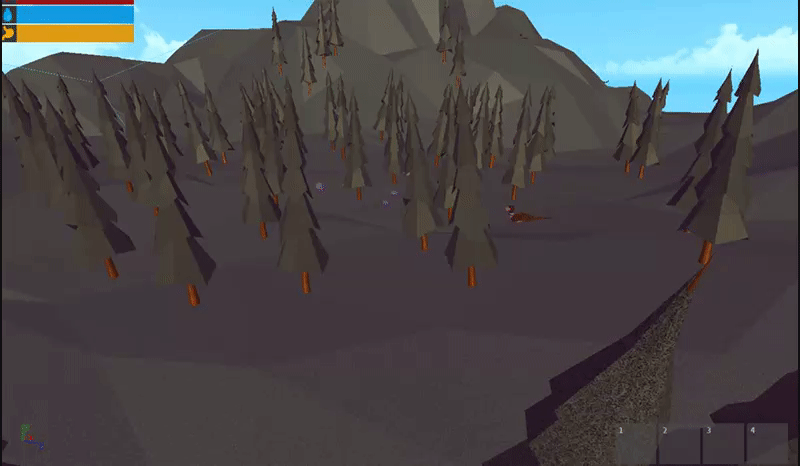

# Aesthetics
Do you recall the lighting effects mentioned previously in this document? If so, I had modified their parameters in order to give the new environment a more appropriate aesthetic. The first image depicts the 'Realistic' lighting whereas the second demonstrates the 'Fantasy' lighting scheme.

 Realistic Lighting Scheme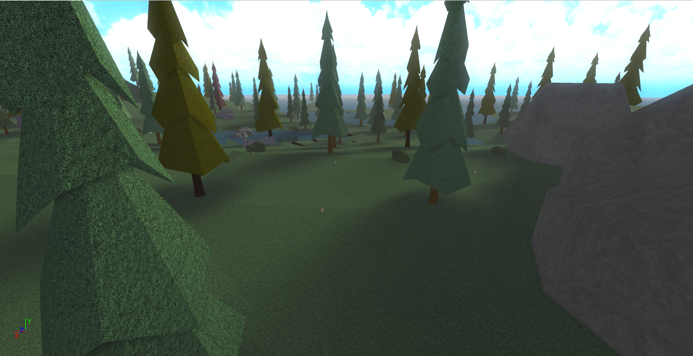

 Fantasy Lighting Scheme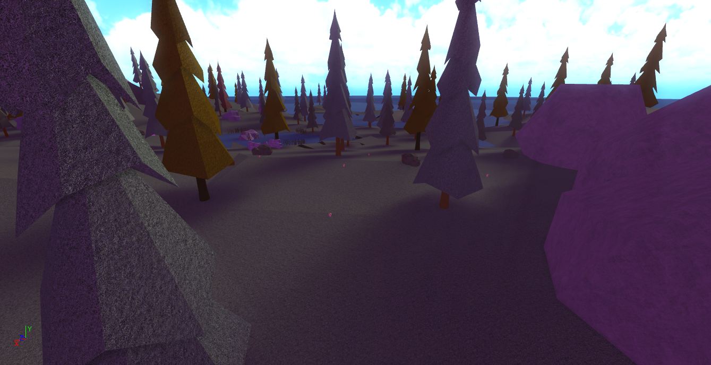

The lighting schemes had heavily influenced the direction of my games design. I want a beautiful game. Let's texture the terrain once more, by adding realistic grass— halt. Let's recall what I had first said right: [here](#restriction1) "my computer lacked the resources needed to make a graphically intensive game." Without proper optimisation, I attempted to use raycasting to fill in 200 grass images per terrain part. Mind you, there is well over two hundred terrain parts in this game. I disliked the notion of simply deleting my efforts, and had thus made this a toggleable option in the aforementioned settings.

# To Bring (more) Life
Wild berries were the only food source attainable in this game, while the idea of cannibalism had appeared in my mind a couple of times (in game), I disliked the idea of it. This game is designed to be a peaceful game where players are rewarded for cooperating in ensuring each others survival. Introducing cannibalism just feels... weird. While deciding the next food source, I realised that my game also lacked liquids. To be specific, the player is stranded on an island surrounded by a massive ocean... where is the ocean? Let's ignore that issue for now as this question had just inspired me to replicate life in a non-existant ocean. Fish are a great food source! Let's grant life to little fish, whose sole purpose is to be murdered to satiate the players hunger.

Do you remember Follower?  Unfortunately, Follower dissapeared after a mysterious accident. The unknown assailant revealed themselves to be me, who later explained that Follower was merely a testing dummy whose life would be used to bring other humanoid entities to this world. Shortly after Follower's death was the appearance of other human-esque beings. Unlike Follower's omnipotence (knowing where the player is at all times), these beings suffer from nearsightedness. The semi-transparent boxes representing their field of vision.

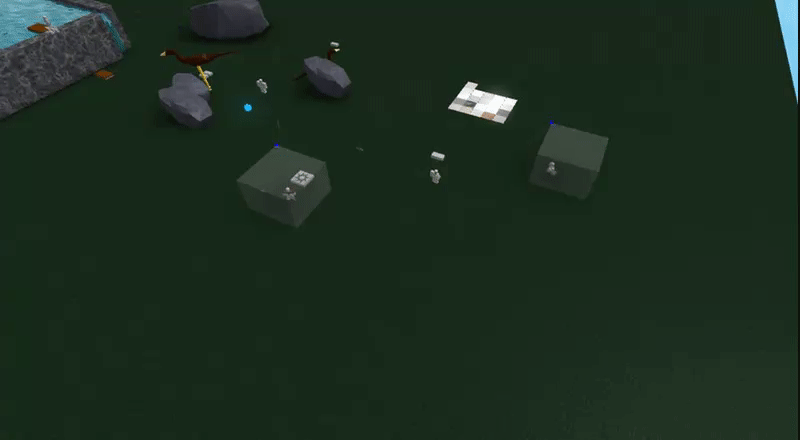

The creator, me, loved these little creatures so much that he decided to give them the ability to interact with the world. At first, he gave them three behaviours. First, you may pick up specific objects (i.e. spear) that are not held by the player. Second, you may approach beings which are nearby. Third, you may roam around as you wish when you are idle. It did not occur to me that my rules did not mention anything such as stealing from one another. I was amused and believed that this behaviour was unintentional but welcomed as it better fits the tribal lifestyle that I was going for.

These tribal beings fend for themselves, but they fight together as a community in order to ward off threats. They had been given nearsightedness to bring more realistic behaviour but their entire existance alone is nonsense. How can one be tragically nearsighted yet possess an immortal body? These beings do not require sustenance and can live on autonomously for as long as the server runs. I decided to strike into their bodies, the desire for food. Given to each entity is the instinct to kill what can be turned into food... fortunately, they are not cannibals.   

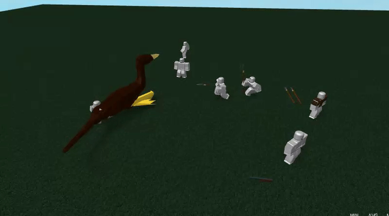

On another note, lets create a small little section of the map to dedicate as the home base for our tribal members.

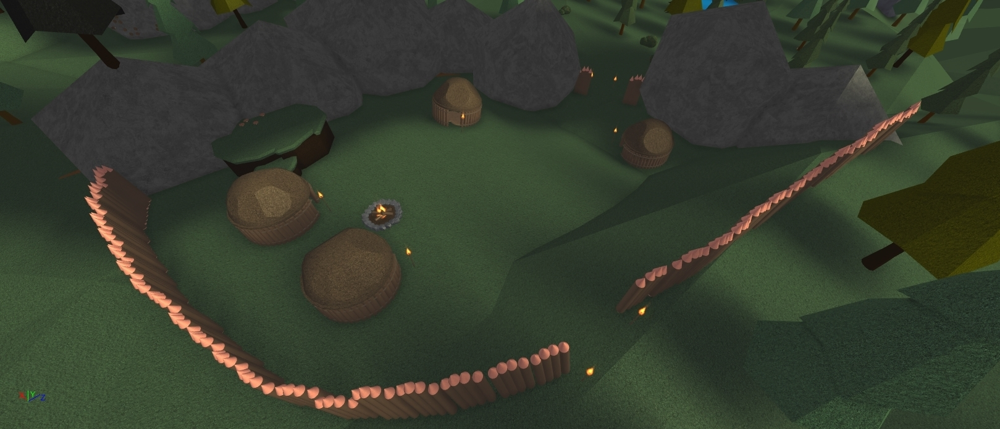

# Ocean
Let us address the question asked earlier, prior to implementing [fish](#fishQuestion): "To be specific, the player is stranded on an island surrounded by a massive ocean... where is the ocean?" The world now generates the ocean on load. Technically speaking, the ocean floor is "procedurally generated" with emphasis on procedurally generated as the parameters heavily restrict the variance of each tile.

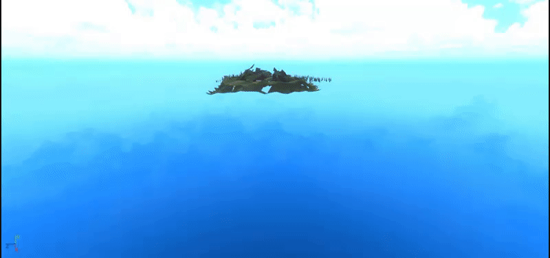

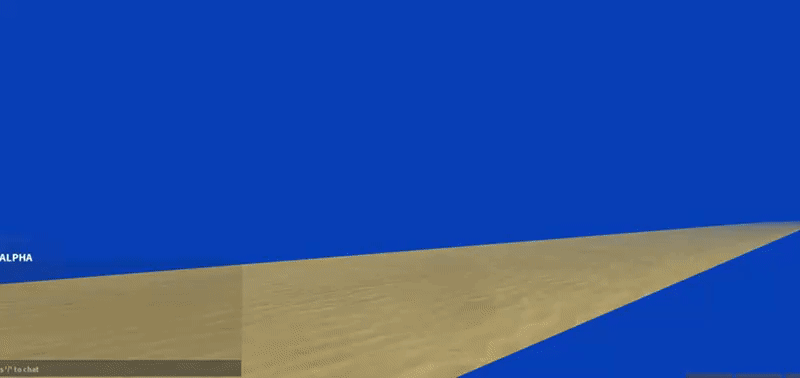

# Character Related Changes

Here is a link to a video which showed [Earlier Demonstration of Game Mechanics](https://youtu.be/eDAnxbEtXYU). I refuse to show the following two as they contain my premature voice which instills the desire to end existing.

By default, Roblox indicates player death by disconnecting the players body parts at their joints. This causes an "explosion" type of death which is unrealistic. To remedy this issue, I kept their limbs intact by replacing the coded joints with freely moveable joints that are constrained by realistic body movements. Introducing, the ragdoll death.

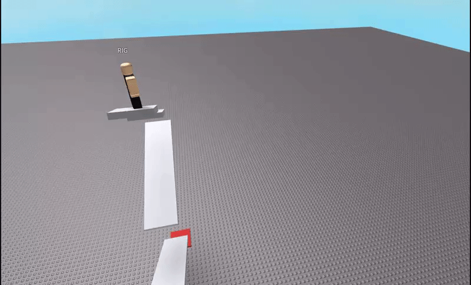

In addition to the ragdoll effect, Roblox allows its users to customize their character. If the developer did not disable custom character appearance, then the player's profile character will be loaded onto the game. I disliked the idea of this as it could break immersion by having characters with odd looking designs. The problem is, the player will desire some form of uniqueness from their peers. If all the people look the same, then it would be hard to differentiate from one another at a glance. Leading to the implementation of the Character Customization screen.

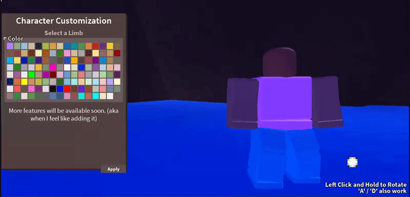

# Inventory

What good is collecting resources without a place to store it?... I think I have written enough rhetorical questions. Yes, I have implemented an inventory system. There are numerous updates which had been skipped throughout this `README.md` file. However, that is of little concern to me. 

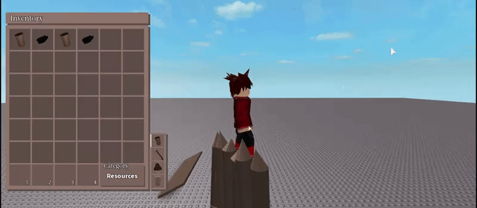

This leads to the final stretch of this projects development. The following image depicts the efforts I had put into this project. Each tree was hand-crafted by myself and procedurally loaded onto the map. The bushes, the rocks, everything was created by me. The subtle fantasy lighting effects on the plain but custom-colored character. Everything on the screen was created by me. As a matter of fact, this image was not even rendered. It is simply a screenshot of the game. I had achieved Aesthetics, but had failed to complete a game.

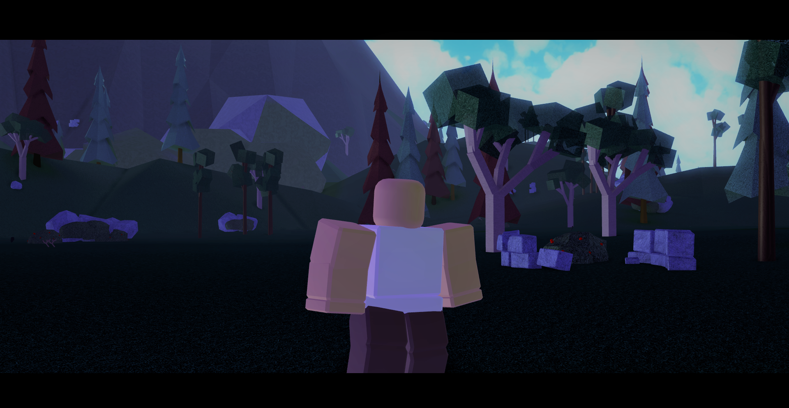

All is not lost however. While this project is not complete, it had helped shape me into becoming the programmer I am today. What would have taken me a day to implement would only take a few hours to create two weeks later. Additionally, every single day, for any problem I was stuck with, I would attempt to think up several approaches to it. Nearly every problem I have today is immediately solved as I can relate it to previously asked questions.

To conclude, this project is now a memory and an important stepping point to my road of becoming the programmer I am now.

The end c:
